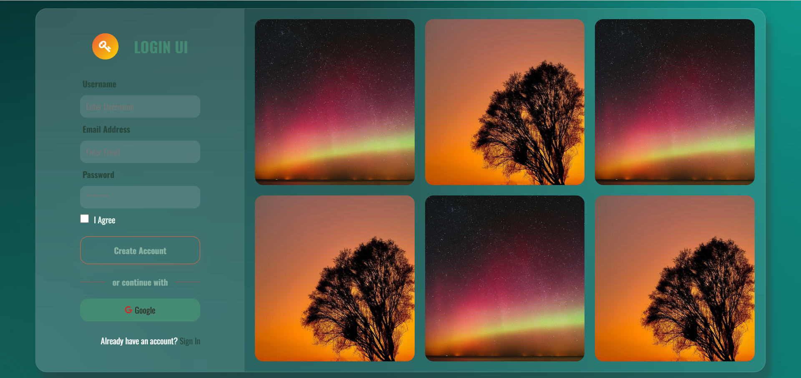

# login | Glassic Login Form 

Login (Glassic Login) is a sleek and modern login form that implements the popular glassmorphism design trend. This project showcases how to create beautiful, frosted-glass UI elements using pure HTML and CSS, featuring backdrop blur effects, transparency, and subtle shadows.

## ✨ Features

- Pure CSS implementation (No JavaScript)
- Responsive design for all devices
- Modern glassmorphism UI with backdrop blur
- Smooth transitions and hover effects
- Semantic HTML structure

## 🛠️ Technologies Used

- HTML5
- CSS3 (Flexbox, Backdrop Filter, Variables)

## 🚀 How to Run

1. Clone the repository
2. Open `index.html` in your browser

## 📸 Preview

## 📝 License

This project is open-source and available under the MIT License.